# Configuración del Oracle Free Tier 

## Introducción

> Este documento de configuración ha sido elaborado para guiarte en la **creación de una cuenta Oracle Cloud Free Tier**, que es necesaria para realizar cualquier laboratorio técnico en Oracle Cloud Infrastructure (OCI).

<br>
### ⭕ **¿Qué es Oracle Cloud?**

[**Oracle Cloud**](https://www.oracle.com/es/cloud/) es una plataforma de infraestructura y servicios en la nube que ofrece una amplia gama de capacidades para soluciones de negocios, aplicaciones y desarrollo. Con OCI, puedes aprovechar recursos de cómputo, almacenamiento, bases de datos, inteligencia artificial, entre otros, todo en un entorno seguro y de alto rendimiento.

<br>
### ⭕ **¿Cómo funciona Oracle Cloud Free Tier?**

Oracle Cloud Free Tier es una cuenta gratuita que ofrece acceso a varios servicios de Oracle Cloud sin costo, con [**$300 USD**](https://www.oracle.com/cloud/free/) en créditos gratuitos válidos por **30 días** y acceso a servicios gratuitos. Esto incluye, pero no se limita a, cómputo, almacenamiento, bases de datos y servicios de inteligencia artificial.

El objetivo principal de Oracle Free Tier es **permitirte experimentar y desarrollar soluciones en Oracle Cloud sin costo inicial.** Es una excelente oportunidad para probar la infraestructura y servicios avanzados de OCI y familiarizarte con los recursos disponibles.

<br>
### **Recursos y Soporte**:

- **Documentación de Oracle Cloud**: [Documentación de Oracle Cloud](https://docs.oracle.com/en/cloud/)
- **Tutoriales**: Explora el [Centro de Aprendizaje de Oracle](https://mylearn.oracle.com/ou/home)


### _**¡Disfruta de tu experiencia en Oracle Cloud!**_


## Task 1: Creación de la Cuenta Oracle Free Tier

### <span style="background-color:#FFFFE0;">**Paso 1.**</span>

Visita el enlace [www.oracle.com/cloud/free](https://www.oracle.com/cloud/free/) y haz clic en **"Start for Free"**.

   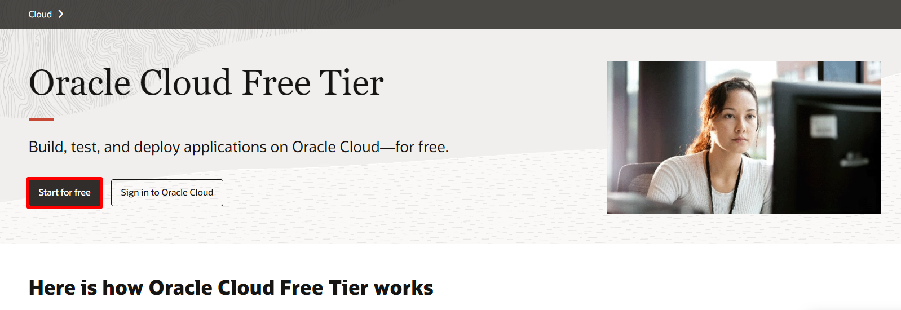

### <span style="background-color:#FFFFE0;">**Paso 2.**</span>

Completa la información de **País, Nombre y Apellido, y Email**. Luego, haz clic en **"Verify my Email"**

   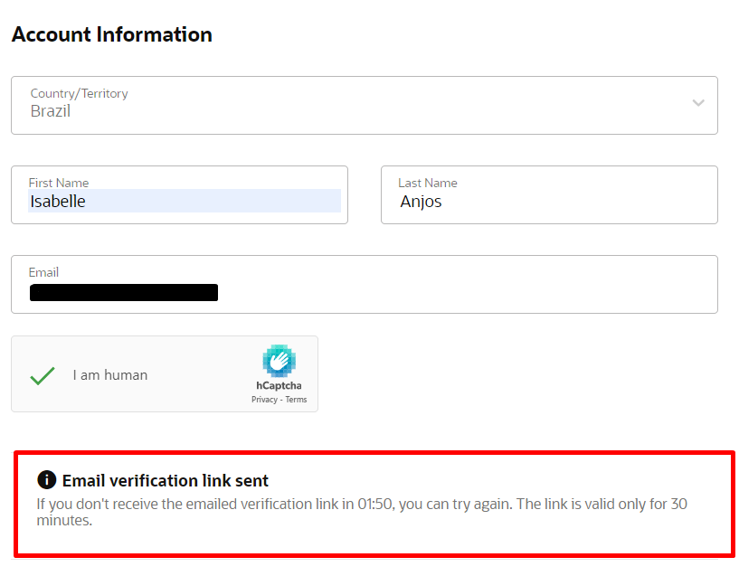


> <span style="background-color:#FFCCCC; color:#D33E43;"><strong>❗ATENCIÓN❗</strong></span><br><br>
> <font color=#D33E43> Si ya tienes un email registrado en Oracle, utiliza un **email alternativo** para crear tu Free Trial. Si ves el mensaje de error que se muestra en la imagen, **actualiza la página** e intenta de nuevo.</font> <br>
> 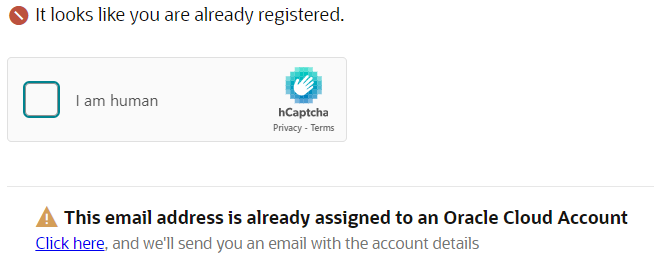


## Task 2: Activación de la Cuenta

### <span style="background-color:#FFFFE0;">**Paso 3.**</span>

Recibirás un correo electrónico similar al ejemplo a continuación. **Verifica que no esté en la carpeta de spam**. Luego, haz clic en **"Verify Email"** para continuar:

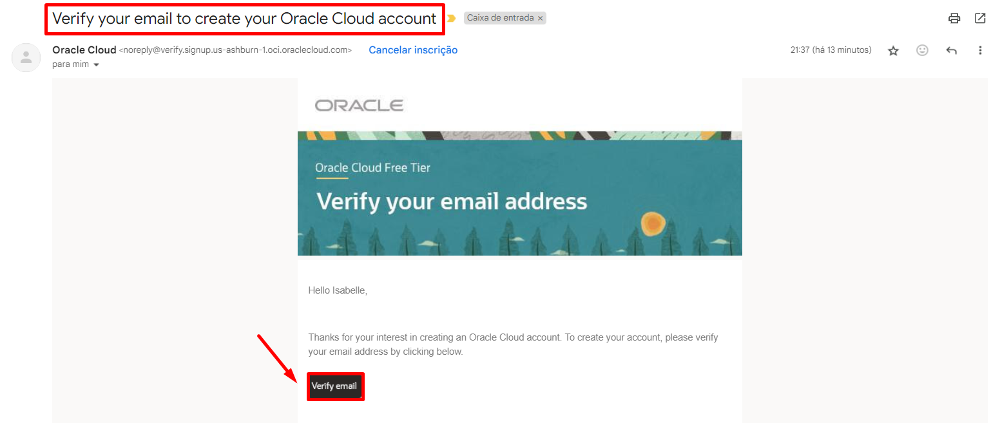

> <span style="background-color:#FFCCCC; color:#D33E43;"><strong>❗ATENCIÓN❗</strong></span><br><br>
> <font color=#D33E43> Completa los siguientes pasos en **hasta 30 minutos** para evitar que el enlace enviado por correo electrónico se reinicie. **Evita hacer clic en el enlace más de una vez**, ya que esto podría generar un mensaje de error.</font> <br>
> 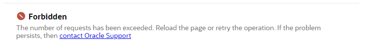

### <span style="background-color:#FFFFE0;">**Paso 4.**</span>

A continuación, crea una contraseña que cumpla con las siguientes reglas:
   - La contraseña debe tener un mínimo de **8 caracteres**, incluyendo **1 letra minúscula**, **1 letra mayúscula**, **1 número** y **1 carácter especial**.
   - La contraseña no puede tener más de **40 caracteres**, ni contener el **nombre**, **apellido**, **dirección de correo electrónico**, **espacios** o los caracteres: ``` ` ~ < > \ ```.

   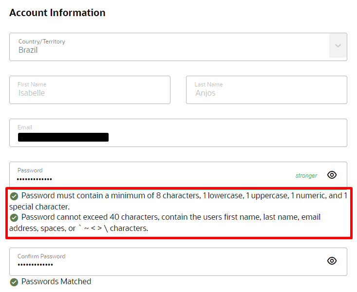

### <span style="background-color:#FFFFE0;">**Paso 5.**</span>

Selecciona las opciones indicadas a continuación:

- **Tipo de Cliente**:
     - Selecciona la opción **Individual**.

- **Home Region**:
    - **Selecciona la opción "Brazil East (Sao Paulo)"** como la región de origen. Los servicios de IA generativa de Oracle están disponibles solo en algunas regiones específicas:
  
        | Region Name             | Location    | Region Identifier | Region Key |
        |-------------------------|-------------|-------------------|------------|
        | Brazil East (Sao Paulo) | Sao Paulo   | sa-saopaulo-1     | GRU        |
        | Germany Central (Frankfurt) | Frankfurt | eu-frankfurt-1   | FRA        |
        | UK South (London)       | London      | uk-london-1       | LHR        |
        | US Midwest (Chicago)    | Chicago     | us-chicago-1      | ORD        |
        {: title=" "}    

- **Confirmación de la Región**:
    - Marca la casilla para confirmar que entiendes que la **región de origen** no puede modificarse después de este paso.
  
- **Términos de Uso**:
    - Lee los Términos de Uso y haz clic en **Continue** para continuar con la configuración de la cuenta.

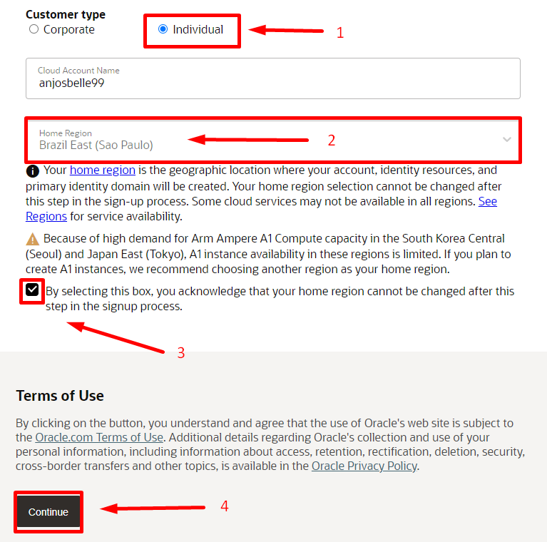

### <span style="background-color:#FFFFE0;">**Paso 6.**</span>

Completa la información de dirección. Después de completar todos los campos, haz clic en **Continue** para continuar.

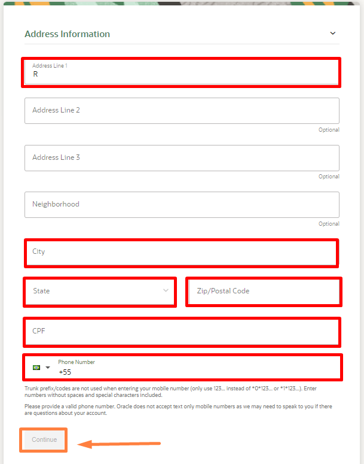

### <span style="background-color:#FFFFE0;">**Paso 7.**</span>

1. Haz clic en **Add payment verification method** para agregar un método de pago.
    > **Usa preferiblemente una tarjeta física** con un límite de crédito disponible de al menos **6 reales**. Las tarjetas digitales pueden no ser aceptadas.

3. Después de agregar el método de pago, marca la casilla de **Agreement** para aceptar los términos.
4. Haz clic en **Start my free trial** para comenzar tu período de prueba gratuito.

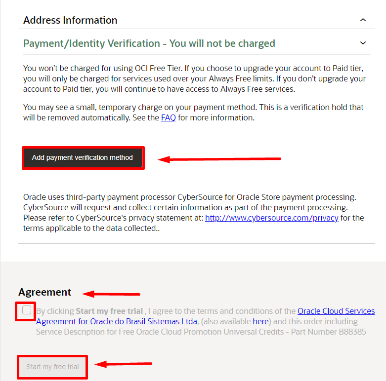

## Task 3: Configuración de la Autenticación de Dos Factores

### <span style="background-color:#FFFFE0;">**Paso 8.**</span>

Después de iniciar el Free Trial, espera mientras Oracle configura tu cuenta. El mensaje **"Please wait while we finish setting up your account"** aparecerá en la pantalla. Este proceso puede tardar unos minutos.

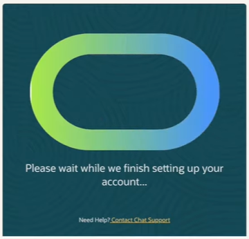

1. Recibirás un correo electrónico de confirmación de Oracle con el título **"Get Started Now with Oracle Cloud"**.
2. En este correo, localiza el **Cloud Account** y el **Username**, que serán necesarios para acceder a tu cuenta en la nube.

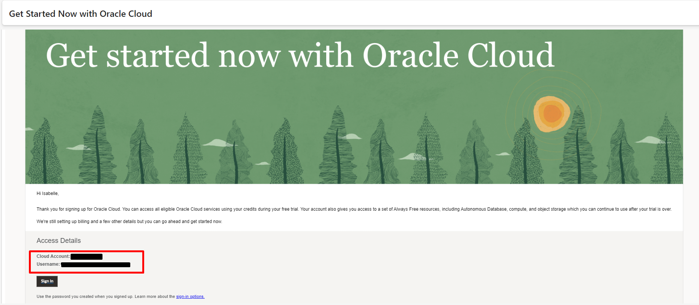

3. Accede a la página de inicio de sesión de Oracle Cloud a través del enlace [www.oracle.com/es/cloud/sign-in.html](https://www.oracle.com/es/cloud/sign-in.html)
4. Ingresa el **Cloud Account** proporcionado en el correo de confirmación.
5. Haz clic en **Próximo** y sigue las instrucciones para finalizar el inicio de sesión.

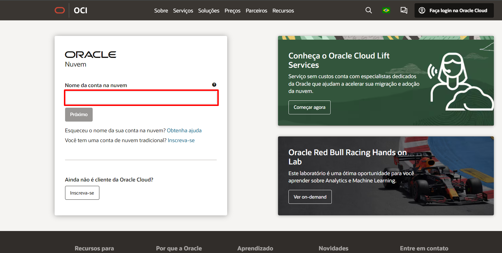

### <span style="background-color:#FFFFE0;">**Paso 9.**</span>

En la siguiente pantalla, haz clic en **Enable Secure Verification** para iniciar la configuración de la autenticación en dos pasos.

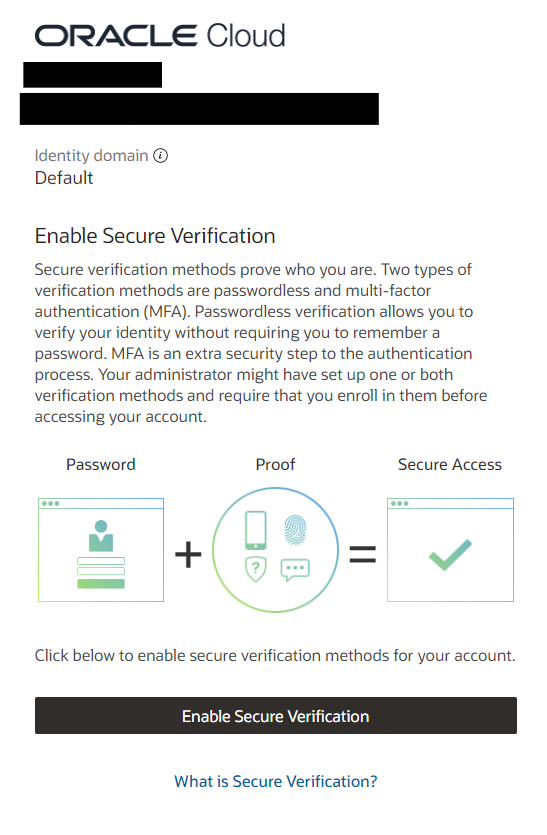

Selecciona el método de autenticación **Mobile App** y busca **Oracle Mobile Authenticator** en la tienda de aplicaciones de tu celular.
   - [Enlace para Android](https://play.google.com/store/apps/details?id=oracle.idm.mobile.authenticator&hl=es)
   - [Enlace para Iphone](https://apps.apple.com/es/app/oracle-mobile-authenticator/id835904829)

Configura la aplicación de autenticación:
   - Abre la aplicación en tu dispositivo móvil.
   - Toca en **Add Account o +** y escanea el código QR que aparece en la pantalla para vincular la aplicación a tu cuenta.

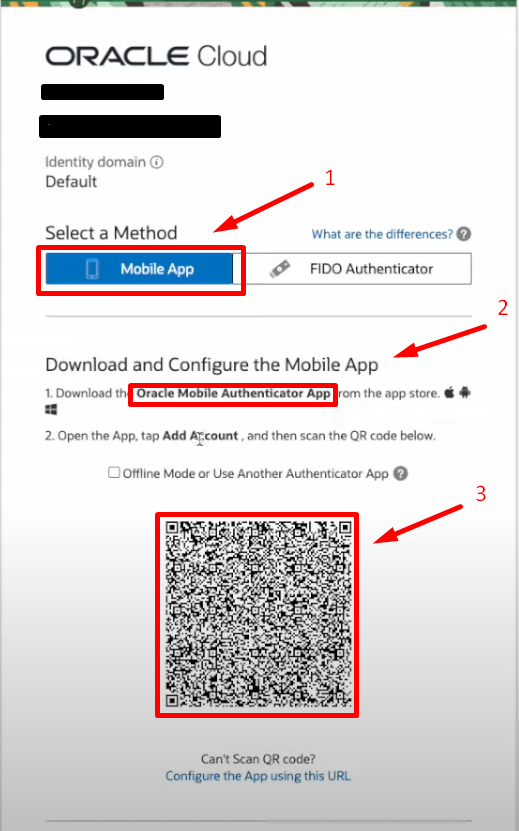

Completa el proceso de configuración:
   - Después de vincular la aplicación, verás una confirmación en la pantalla con el mensaje **Successfully Enrolled**.
   - Haz clic en **Done** para finalizar el proceso.

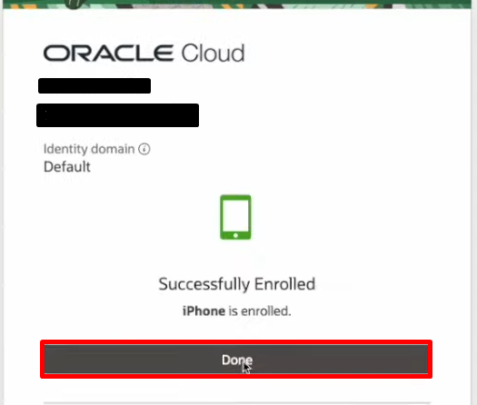

## Task 4: Acceso a la cuenta

### <span style="background-color:#FFFFE0;">**Paso 10.**</span>

Después de realizar el proceso de configuración de dos factores, serás dirigido a la pantalla de inicio de sesión. Ingresa tu **email** y **contraseña** registrados, luego haz clic en **Sign In** para continuar.

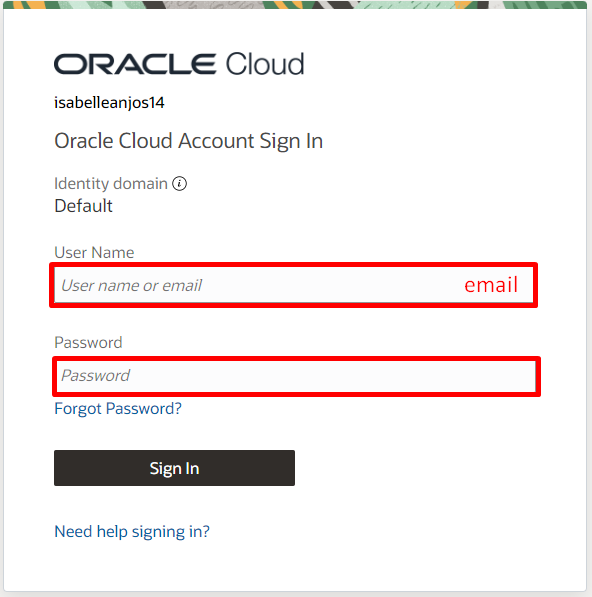

Recibirás una **notificación** en el dispositivo configurado con **Oracle Mobile Authenticator**. Abre la notificación y toca en **Allow** para continuar con el inicio de sesión.

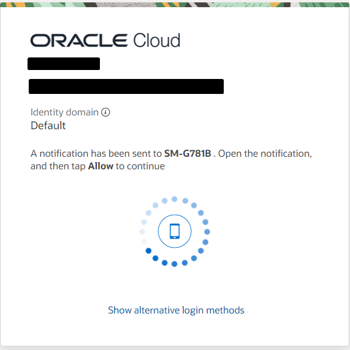

Después de iniciar sesión, serás redirigido al panel de Oracle Cloud.
  - Verifica que la **región seleccionada** en la esquina superior derecha sea "Brazil East (São Paulo)" para asegurar el acceso a los servicios de IA generativa.
  - En el panel, puedes ver los créditos restantes y acceder a los enlaces para los servicios, como **OCI Generative AI Services**.

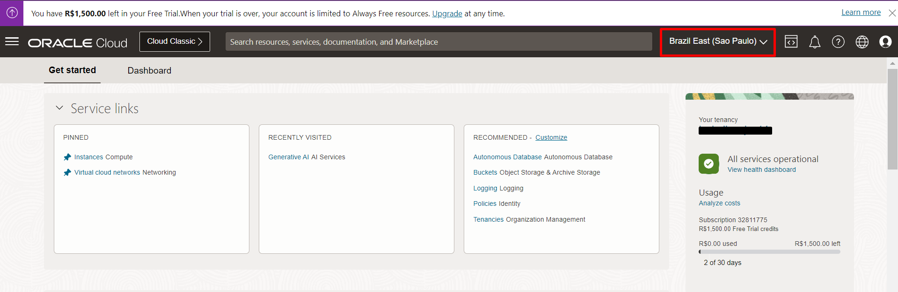


## Sumario

Con tu cuenta Oracle Cloud Free Tier configurada, ahora puedes proceder con cualquier laboratorio técnico en OCI. **¡Explora al máximo tus créditos gratuitos para descubrir todo lo que Oracle Cloud tiene para ofrecer!**

## Agradecimientos

- **Autores** - Isabelle Anjos
- **Autor Contribuyente** - Isabelle Anjos
- **Última Actualización Por/Fecha** - Octubre 2024
