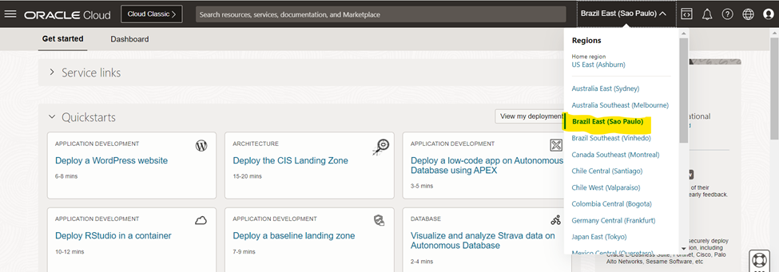
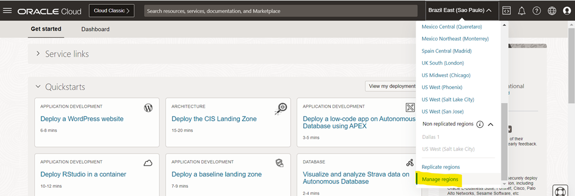
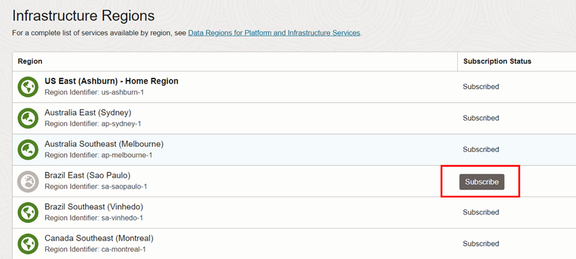
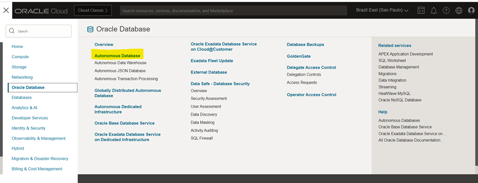
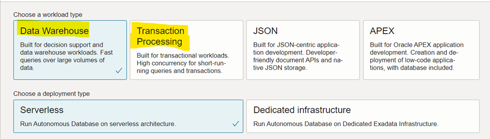
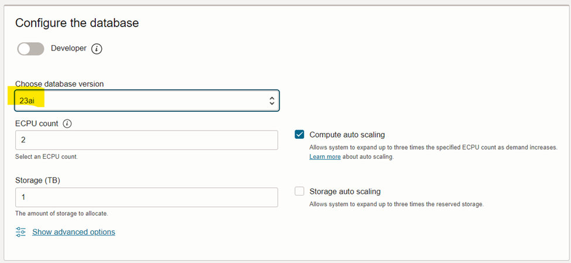
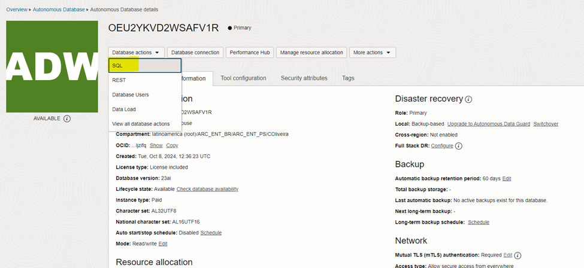

# Oracle 23ai Vector Search

## Introdução

>**Com o Oracle 23ai, o Oracle AI Vector Search foi adicionado ao Oracle Database, aprimorando perfeitamente a estratégia de banco de dados convergente da Oracle, ao integrar nativamente a funcionalidade de vetores.** 

Ele pode ser combinado com a busca relacional em dados de negócios em um único sistema. O Oracle AI Vector Search foi projetado para cargas de trabalho de Inteligência Artificial (IA) e permite consultar dados com base em semântica, em vez de palavras-chave. 
 
Dessa forma, você não precisa adicionar um banco de dados de vetores especializado, **eliminando o problema de fragmentação de dados entre vários sistemas.** 

Além disso, há uma integração profunda com outros recursos do Oracle Database, incluindo, mas não se limitando a, **segurança, disponibilidade, desempenho, particionamento, GoldenGate, RAC, Exadata, etc.** Os dados mantidos no Oracle Database podem ser acessados diretamente via SQL, sem a necessidade de convertê-los em uma forma intermediária. 
  
### ⭕ **O que é Vector Database?**

> Um banco de dados vetorial é qualquer banco de dados que pode armazenar e gerenciar embeddings vetoriais de forma nativa e lidar com os dados não estruturados que eles descrevem, como documentos, imagens, vídeos ou áudios.

 
### ⭕ **Como o Oracle AI Vector Search revoluciona a busca de dados semânticos no Oracle Database?**

De modo geral, você pode criar tabelas com o novo tipo de dado vetorial VECTOR, inserir vetores usando INSERT, carregar vetores utilizando o SQL Loader ou carregar e descarregar utilizando o Data Pump, ou ainda criar índices vetoriais em suas embeddings de vetores. Novas funções SQL foram adicionadas, como funções de distância vetorial, além de várias outras funções e operadores SQL que você pode utilizar com vetores no Oracle AI Vector Search para criar, converter e descrever vetores, ou para realizar chunking e embedding de dados.
 

### **Objetivos**

O objetivo deste workshop é demonstrar de forma prática como utilizar a funcionalidade de busca vetorial do Oracle 23c AI Vector Search. Durante o workshop, você aprenderá a criar e configurar um banco de dados autônomo (Autonomous Database) no Oracle Cloud Infrastructure (OCI), carregar e gerenciar embeddings de vetores, integrar modelos ONNX para gerar embeddings semânticos a partir de documentos, e realizar buscas vetoriais para recuperar informações relevantes com base em similaridade semântica, aplicando essas técnicas em um cenário que envolve a consulta de bulas de remédios.

 
### **Recursos e Suporte**:

- **Documentação da Oracle Cloud**: [Getting started with vectors in 23ai](https://blogs.oracle.com/coretec/post/getting-started-with-vectors-in-23ai)
- **Tutoriais**: [Oracle Database 23ai - Oracle AI Vector Search & Retrieval Augmented Generation (RAG) with Oracle APEX](https://www.linkedin.com/pulse/oracle-database-23ai-ai-vector-search-retrieval-augmented-rao-bqkcf/)

### _**Aproveite sua experiência na Oracle Cloud!**_

## Task 1: Validação de Região

Faça o login no Oracle Cloud Infrastructure (OCI) e valide se a região de São Paulo se encontra disponível para uso.

   

> **Caso a região de São Paulo não esteja disponível, clique em manage region (caso já esteja disponível pule para a sessão 2 - Criação de Autonomous Database)** 

Busque por **Brazil East (Sao Paulo)** e clique no botão subscribe. O processo de subscrição pode levar alguns minutos, aguarde para dar sequência ao workshop. Clique no ícone escrito **Oracle Cloud** no canto esquerdo e faça logoff e login para validar se a região já foi subscrita.

## Task 2: Criação de Autonomous Database

Clique no menu de hambúrger do canto superior esquerdo da tela, na sequência navegue até a página de gestão de autonomous databases.

Na página de gestão de Autonomous Databases, clique em create autonomous database. Selecione **ATP ou ADW**
  

Escolha a versão 23ai para o banco de dados:

Coloque uma senha que consiga lembrar, escolha **secure access from everywhere** e clique em **Create Autonomous Database**:

Aguarde até a conclusão da criação: 
- Ícone amarelo = criando; 
- Ícone verde = pronto para uso;

## Task 3: Configurando o Autonomous Database

Clique no ícone chamado database actions e SQL:

Caso seja requisitado, o usuário é **admin** e a senha é a **fornecida na criação do autonomous database da etapa anteiror.**
Feche todos os tutoriais que aparecerão na página.
Copie, cole e execute os comandos abaixo:

    <copy>  
        --Criação de credencial
    BEGIN
        DBMS_CLOUD.CREATE_CREDENTIAL(
            credential_name => 'OBJ_STORE_CRED',
            username => 'oracleidentitycloudservice/CAIO.OLIVEIRA@ORACLE.COM',
            password => 'teste'
        );
    END;
    /

    --Download de Modelo onnx do object storage para diretorio autonomous
    begin
    dbms_cloud.get_object(
        credential_name => 'OBJ_STORE_CRED'
        , object_uri => 'https://objectstorage.sa-saopaulo-1.oraclecloud.com/p/nS9blF5U2ETiZT7YKZ_zrXtPOEH2Xf22TbdlpK99xZIEPmZedx4_eFBX4khYykmw/n/idi1o0a010nx/b/TDC/o/intfloatmodelsmall.onnx'
        , directory_name => 'DATA_PUMP_DIR'
        , file_name => 'intfloatmodelsmall.onnx'
    );
    end;
    /

    --Import de modelo onnx para autonomous
    EXECUTE dbms_vector.load_onnx_model('DATA_PUMP_DIR', 'intfloatmodelsmall.onnx', 'admin.doc_model', JSON('{"function" : "embedding", "embeddingOutput" : "embedding" , "input": {"input": ["DATA"]}}'));
    commit;

    --Download de Arquivo para upload (Bula Remédio 01)
    begin
    dbms_cloud.get_object(
        credential_name => 'OBJ_STORE_CRED'
        , object_uri => 'https://objectstorage.sa-saopaulo-1.oraclecloud.com/p/z4N9MiLKEgxU1xeIlOoJp0yT9u9A5cz_MD6Ng-IqtgMwFZUS8tmA-6Vlz7FA-aeQ/n/idi1o0a010nx/b/TDC/o/OK-Engov.pdf'
        , directory_name => 'DATA_PUMP_DIR'
        , file_name => 'OK-Engov.pdf'
    );
    end;
    /

    --Download de Arquivo para upload (Bula Remédio 02)
    begin
    dbms_cloud.get_object(
        credential_name => 'OBJ_STORE_CRED'
        , object_uri => 'https://objectstorage.sa-saopaulo-1.oraclecloud.com/p/ScTV-lu7p7m_nqAqTIFf91zBVf1Z9I7ZO8VsrHh9arZqev_E_HZ0JobfF_9TJVUw/n/idi1o0a010nx/b/TDC/o/OK-TYLENOL.pdf'
        , directory_name => 'DATA_PUMP_DIR'
        , file_name => 'OK-TYLENOL.pdf'
    );
    end;
    /
    </copy>

Execute conforme indicado abaixo:

## Task 4: Criação de Objetos e Validação de Ambiente

Copie, cole e execute os comandos abaixo:

    <copy>  
    --Criação de tabela para upload de arquivos
    CREATE TABLE documentation_tab (id number, data blob);

    --Inserção de bulas de remédios
    INSERT INTO documentation_tab values(1, to_blob(bfilename('DATA_PUMP_DIR', 'OK-Engov.pdf')));  
    INSERT INTO documentation_tab values(1, to_blob(bfilename('DATA_PUMP_DIR', 'OK-TYLENOL.pdf')));
    commit;

    --Criação de chunks e embedding
    CREATE TABLE doc_chunks as
    (select dt.id doc_id, et.embed_id, et.embed_data, to_vector(et.embed_vector) embed_vector
    from
    documentation_tab dt,
    dbms_vector_chain.utl_to_embeddings(
        dbms_vector_chain.utl_to_chunks(dbms_vector_chain.utl_to_text(dt.data), json('{"normalize":"all"}')),
        json('{"provider":"database", "model":"doc_model"}')) t,
    JSON_TABLE(t.column_value, '$[*]' COLUMNS (embed_id NUMBER PATH '$.embed_id', embed_data VARCHAR2(4000) PATH '$.embed_data', embed_vector CLOB PATH '$.embed_vector')) et
    );
    commit;

    --Criação de Function para busca vetorial
    CREATE OR REPLACE FUNCTION rag_function ( rag_input IN VARCHAR2 ) 
    RETURN NUMBER 
    IS  
        query_vector CLOB;
        text_variable VARCHAR2(4000) := rag_input;
        l_doc_id VARCHAR2(100); 
        CURSOR c1 IS 
            SELECT * 
            FROM doc_chunks 
            ORDER BY VECTOR_DISTANCE(EMBED_VECTOR, query_vector, EUCLIDEAN_SQUARED) 
            FETCH FIRST 3 ROWS ONLY WITH TARGET ACCURACY 97;  
    BEGIN 
        -- Select vector embedding
        SELECT vector_embedding(doc_model USING text_variable AS data) 
        INTO query_vector 
        FROM dual;

        -- Loop through the result set
        FOR row_1 IN c1 LOOP  
            -- Output using DBMS_OUTPUT.PUT_LINE
            DBMS_OUTPUT.PUT_LINE('Embed Data: ' || SUBSTR(row_1.embed_data, 1, 4000)); -- Use SUBSTR to limit output length if necessary
        END LOOP;

        RETURN 1;
    EXCEPTION
        WHEN OTHERS THEN
            DBMS_OUTPUT.PUT_LINE('Error: ' || SQLERRM);
            RETURN 0;
    END;
    /

    </copy>

## Task 5: Consulta de Informações na Bula

Copie, cole e execute os comandos abaixo:

*Transformando sua pergunta em vetor, de acordo com o modelo importado:*

    <copy>  
    --Transformando sua pergunta em vetor, de acordo com o modelo importado
    SELECT vector_embedding(doc_model USING '<SUA PERGUNTA>' AS data) FROM dual;
    </copy>
<!-- Separador -->

**Exemplo:**

    <copy> 
    SELECT vector_embedding(doc_model USING 'O QUE É O TYLENOL' AS data) FROM dual;
    </copy>

*Consulta de informações entre as bulas de remédios*
<!-- Separador -->
    <copy> 
    --Consulta de informações entre as bulas de remédios
    DECLARE
        v_input varchar2(4000) := '<SUA PERGUNTA>';
        v_n number;
    BEGIN 
        v_n := rag_function ( v_input ); 
        DBMS_OUTPUT.put_line('Function returned: ' || v_n);
    END;
    /
    </copy>

<!-- Separador -->

**Exemplo:**

    <copy> 
    DECLARE
        v_input varchar2(4000) := 'O QUE É O TYLENOL';
        v_n number;
    BEGIN 
        v_n := rag_function ( v_input ); 
        DBMS_OUTPUT.put_line('Function returned: ' || v_n);
    END;
    /
    </copy>

## Agradecimentos

- **Autores** - Caio Oliveira
- **Autor Contribuinte** - Isabelle Anjos
- **Última Atualização Por/Data** - Outubro 2024

## Declaração de Porto Seguro (Safe Harbor)

O texto a seguir tem como objetivo traçar a orientação dos nossos produtos em geral. É destinado somente a fins informativos e não pode ser incorporado a um contrato. Ele não representa um compromisso de entrega de qualquer tipo de material, código ou funcionalidade e não deve ser considerado em decisões de compra. O desenvolvimento, a liberação, a data de disponibilidade e a precificação de quaisquer funcionalidades ou recursos descritos para produtos da Oracle estão sujeitos a mudanças e são de critério exclusivo da Oracle Corporation.

Esta é a tradução de uma apresentação em inglês preparada para a sede da Oracle nos Estados Unidos. A tradução é realizada como cortesia e não está isenta de erros. Os recursos e funcionalidades podem não estar disponíveis em todos os países e idiomas. Caso tenha dúvidas, entre em contato com o representante de vendas da Oracle. 
