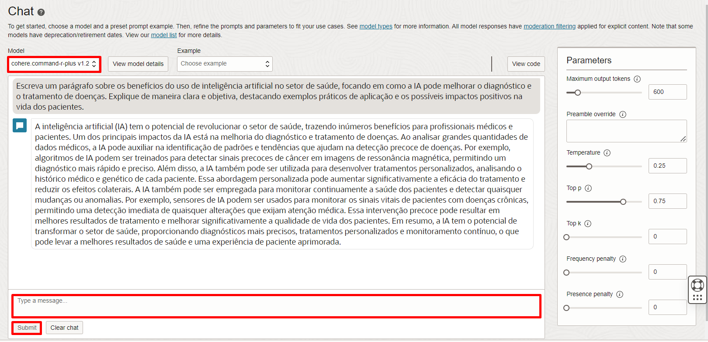
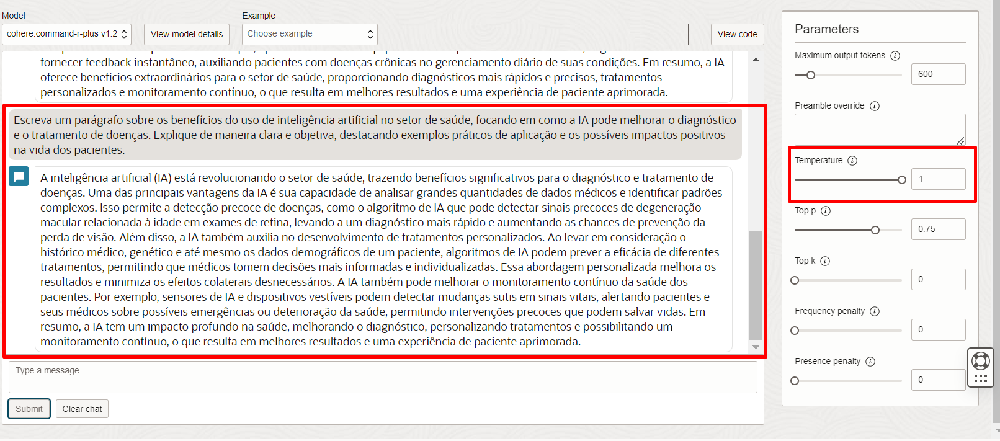
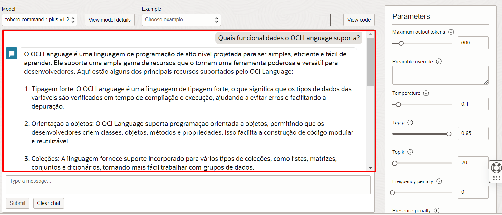

# Exploración del Playground del Servicio OCI Generativa AI

## Introducción

> La IA Generativa está transformando la forma en que navegamos y utilizamos el conocimiento, desde la síntesis de datos complejos hasta la creación de respuestas contextuales. Con Oracle Cloud Infrastructure (OCI), incorporar funcionalidades de IA generativa nunca ha sido tan accesible.

 
### ⭕ **¿Qué es la Inteligencia Artificial Generativa?**

La Inteligencia Artificial Generativa es una tecnología de IA que crea nuevos contenidos, como textos, imágenes y videos, a partir de datos de entrenamiento. En lugar de solo analizar datos, produce contenidos originales, simulando la creatividad humana.

| Capacidad          | Ejemplos de Aplicaciones                          |
|--------------------|--------------------------------------------------|
| Creación de Contenido | Textos, imágenes, videos, audio                  |
| Asistencia         | Atención al cliente, asistentes virtuales        |
| Innovación         | Diseño de productos, investigación y desarrollo  |
{: title=" "}

 
### ⭕ **¿Por qué es importante la Inteligencia Artificial Generativa?**

La IA Generativa automatiza tareas creativas y cognitivas, lo que puede:
- **Aumentar la productividad**: Generación rápida de contenido personalizado.
- **Impulsar la innovación**: Herramientas para experimentación y desarrollo ágil.
- **Mejorar la experiencia del cliente**: Respuestas e interacciones más naturales.

 
### ⭕ **¿Qué es el Servicio de IA Generativa de OCI?**

El [**OCI Generative AI**](https://www.oracle.com/artificial-intelligence/generative-ai/large-language-models/) es un servicio gestionado que ofrece acceso a modelos de IA Generativa, como Llama 3.1 y Cohere Command R. Permite explorar e integrar IA generativa para diversos casos de uso, de manera escalable y segura.

Este servicio ofrece una forma práctica de incorporar IA Generativa, sin necesidad de gestionar infraestructura compleja. El servicio posibilita experimentación rápida e integraciones directas para facilitar el desarrollo de soluciones inteligentes y personalizadas. Modelos disponibles:

| Modelo              | Descripción                                                                                             | Principales Características                              | Idiomas Soportados |
|---------------------|---------------------------------------------------------------------------------------------------------|----------------------------------------------------------|---------------------|
| **Cohere Command R**   | Modelo optimizado para aplicaciones de **retrieval-augmented generation (RAG)**.                         | Alta eficiencia, baja latencia, mayor ventana de contexto | 10 idiomas          |
| **Cohere Command R+**  | Versión mejorada del Command R para **casos de uso especializados** como generación de contenido largo. | Genera respuestas contextuales y detalladas               | 10 idiomas          |
| **Cohere Embed**       | Modelos de embeddings para **convertir texto en representaciones vectoriales**.                       | Las versiones "Light" son más pequeñas y rápidas          | Inglés y Multilingüe |
| **Meta Llama 3.1**     | Modelos open source de última generación con **alto rendimiento y diversidad de respuestas**.          | Ventana de contexto de 128K y soporte para 8 idiomas      | 8 idiomas           |
{: title=" "}

### **Objetivos**

En este workshop, aprenderás a explorar los modelos de IA Generativa de OCI, basados en grandes modelos de lenguaje (LLMs). Aunque es posible integrar el servicio vía APIs REST, permitiendo que incorpores esta tecnología avanzada en tus soluciones de manera práctica y eficiente, en este laboratorio usaremos el **playground** del servicio de IA Generativa en OCI. El playground ofrece una forma práctica e interactiva de experimentar los recursos de IA generativa, sin necesidad de configuraciones para integrar la funcionalidad a otros servicios.

El laboratorio se dividirá en tres etapas, explorando diferentes aspectos de LLMs e IA Generativa:

1. **Embeddings**: Comprender cómo los embeddings se utilizan para representar y buscar información de manera eficiente.
2. **Generación de Texto**: Aprender a generar textos personalizados y contextuales para diversos casos de uso.
3. **Simulación de Flujo de RAG (Retrieval-Augmented Generation)**: Ver cómo integrar la recuperación de información con generación de texto para crear respuestas contextuales a partir de datos específicos.

 
### **Recursos y Soporte**:

- **Documentación de Oracle Cloud**: [¿Qué es la Inteligencia Artificial Generativa?](https://www.oracle.com/br/artificial-intelligence/generative-ai/what-is-generative-ai/)
- **Tutoriales**: Explora el [Centro de Aprendizaje de Oracle](https://mylearn.oracle.com/ou/home)

### _**¡Disfruta tu experiencia en Oracle Cloud!**_

## Tarea 1: Modelos de Embeddings

### ⭕ **¿Qué son los Embeddings?**
> Los embeddings son representaciones vectoriales de objetos, como textos o imágenes. **Al transformar objetos en vectores, podemos realizar operaciones matemáticas que permiten comparar, analizar y calcular la similitud entre ellos.** Esto posibilita, por ejemplo, identificar semejanzas entre textos o buscar información relevante de manera eficaz.

### 🔍 **¿Por qué son importantes los Embeddings?**
   - **Análisis de Similitud:** Con embeddings, podemos calcular la proximidad entre diferentes objetos, facilitando la identificación de ítems similares.
   - **Eficiencia Computacional:** Representar datos en vectores hace que el procesamiento de información sea más rápido y eficiente.
   - **Versatilidad:** Los embeddings se pueden utilizar en varios contextos, como búsqueda de información, recomendación de contenido, entre otros.

### **Paso 1.**

Acceder al Servicio de OCI Generative AI. La forma más sencilla de hacer esto es buscando por **“Generative AI”** en la barra de búsqueda:

   

Una vez dentro del servicio, seleccionaremos **“Embedding”**, en el menú del lado izquierdo, debajo de **“Playground”**.

   

### **Paso 2.**

Dentro del Playground, vamos a la caja de selección “model” y seleccionamos el modelo **cohere.embed-multilingual-v3**, luego, añadimos las frases a continuación en las cajas blancas disponibles. No es necesario que estén en orden:

    <copy>
    Los perros son animales increíbles.
    </copy>
<!-- Separador -->

    <copy>  
    Amo a los perros, son fantásticos.  
    </copy>  
<!-- Separador -->

    <copy>  
    A los perros les encanta jugar al aire libre y correr por el parque.  
    </copy>  
<!-- Separador -->

    <copy>  
    Los gatos son animales elegantes y misteriosos.  
    </copy>  
<!-- Separador -->

    <copy>  
    Los gatos son expertos en encontrar los mejores lugares para dormir.  
    </copy>  
<!-- Separador -->

    <copy>  
    Los gatos tienen una habilidad increíble para colarse en espacios pequeños.  
    </copy>  
<!-- Separador -->

    <copy>  
    Porsche fabrica coches hermosos.  
    </copy>  
<!-- Separador -->

    <copy>  
    Ferrari es conocida por sus coches rápidos.  
    </copy>  
<!-- Separador -->

    <copy>  
    Los coches deportivos son para quienes buscan emoción en la carretera.  
    </copy>  
<!-- Separador -->

    <copy>  
    A los gatos les gusta esconderse en coches deportivos, como en un Ferrari.  
    </copy>  
<!-- Separador -->

    <copy>  
    A los perros les encanta disfrutar del viento mientras pasean en coches descapotables, como un Porsche.  
    </copy>  

Luego, haz clic en **Run**.

### **Paso 3.**

> **Los vectores de embeddings suelen tener muchas dimensiones (generalmente, entre 512 y 1024 dimensiones). Como es imposible visualizar gráficamente algo con tantas dimensiones, lo que se suele hacer es una “Proyección” de estos vectores multidimensionales en superficies bidimensionales, permitiendo la visualización.**

La proximidad entre los vectores en el gráfico representa la **similitud semántica entre las frases.** Cuanto más cercanos estén dos puntos, más similares son las frases en términos de contenido y contexto, según el modelo de embedding.

Por ejemplo:
   - **Vectores 1, 2, 3, 4, 5 y 6:** Las frases sobre características y comportamientos de gatos y perros están agrupadas, reflejando similitudes relacionadas con los animales y sus acciones típicas.
   - **Vectores 7, 8 y 9:** Las frases que mencionan coches deportivos y marcas como Ferrari y Porsche están próximas entre sí, ya que comparten temas de automóviles y experiencias de conducción.
   - **Vectores 10 y 11:** Las frases sobre "gato y Ferrari" y "perro y Porsche" están próximas entre sí y de los clústeres de coches de lujo, ya que combinan comportamientos de mascotas con automóviles, uniendo ambos temas.

## Tarea 2: Modelos de Generación de Texto

### ⭕ **¿Qué son 'Tokens' y 'Parámetros' en Modelos de Generación de Texto?**
> **Tokens** son unidades de texto, como palabras, partes de palabras,

 o incluso caracteres, que el modelo utiliza para construir frases. En lugar de generar una frase entera de una vez, el modelo procesa el texto eligiendo un token a la vez, siguiendo una secuencia hasta formar la respuesta completa.
  
> **Parámetros** ajustan la forma en que el modelo decide el próximo token, permitiendo un equilibrio entre creatividad y coherencia en la generación de texto.

| **Parámetros**       | **Descripción**                                                                                                                                                                                                                                    | **Ejemplo**             |
|---------------------|--------------------------------------------------------------------------------------------------------------------------------------------------------------------------------------------------------------------------------------------------|--------------------------|
| **Temperatura**   | Controla la aleatoriedad en la generación del texto. Valores bajos hacen que el texto sea más directo y predecible, mientras que valores altos hacen que el texto sea más creativo e inesperado, pudiendo afectar la coherencia.                                           | Baja (0.2) = "El coche es rojo y rápido."   Alta (0.8) = "El coche es rojo, veloz y parece un cohete." |
| **Top-p** (Núcleo) | Limita las opciones del modelo a los tokens más probables hasta que la suma de sus probabilidades alcance un cierto porcentaje. Esto mantiene el control sobre la variabilidad del texto, evitando opciones improbables.                                    | Top-p = 0.9 considera los tokens más probables que suman 90% de la probabilidad total, enfocándose en las opciones más probables. |
| **Top-k**          | Restringe la elección a los k tokens más probables, lo que ayuda a mantener el texto coherente y enfocado al seleccionar entre las opciones más probables, según el límite determinado.                                                              | Top-k = 50 limita la elección a los 50 tokens más probables, restringiendo la variabilidad para mayor coherencia. |
{: title=" "}

### **Paso 4.**

> **Ahora, vamos a analizar cómo se comporta el modelo en la generación de texto, enfocándonos especialmente en la influencia del parámetro Temperatura. En la generación de texto, existen varios otros parámetros que influyen en la elección de cada palabra (o token). Para ello, probaremos diferentes combinaciones de estos parámetros en varios escenarios de generación de texto.**

Una vez dentro del servicio, seleccionaremos **“Chat”**, en el menú del lado izquierdo, debajo de **“Playground”**. 

En la pantalla indicada a continuación, selecciona el modelo **cohere.command-r-plus v1.2**. Añade el siguiente prompt al chat, en la región inferior de la pantalla y haz clic en **Submit**:

    <copy>
    Escribe un párrafo sobre los beneficios del uso de inteligencia artificial en el sector de la salud, enfocándote en cómo la IA puede mejorar el diagnóstico y tratamiento de enfermedades. Explica de manera clara y objetiva, destacando ejemplos prácticos de aplicación y los posibles impactos positivos en la vida de los pacientes.
    </copy>

### **Paso 5.**

> **Inicialmente, estamos generando una respuesta utilizando los parámetros predeterminados. Una vez generada la respuesta, vamos a repetir con el mismo prompt, ajustando los parámetros. ¿Qué piensas que podría pasar?**

**Ejemplo 1:** La temperatura está alta (1), permitiendo una respuesta más creativa y variada, pero aún coherente. Top-k es cero, sin limitación en la cantidad de tokens más probables, permitiendo opciones más amplias.

**Ejemplo 2:** La temperatura está baja (0.25), generando un texto más predecible y seguro. Top-k está en 500, dando una amplia variedad de opciones, pero la baja temperatura mantiene el texto directo y menos creativo.

**Ejemplo 3:** La temperatura fue elevada a 2, lo que resultó en una respuesta menos coherente con repeticiones aleatorias. Top-p está muy bajo (0.05), restringiendo las opciones y llevando a una respuesta poco útil. La combinación de estos valores genera inestabilidad en el texto.

## Tarea 3: Simulando un Flujo de RAG

### ⭕ **¿Qué es Retrieval-Augmented Generation (RAG)?**
> Retrieval-Augmented Generation (RAG) es una técnica que combina modelos generativos con sistemas de recuperación de información. **Al incorporar una etapa de recuperación, RAG permite que el modelo de IA acceda a datos específicos antes de generar una respuesta, integrando información relevante en el contexto del usuario.** Esto ayuda a reducir las alucinaciones y mejora la precisión de las respuestas, especialmente en dominios especializados.

### 🔍 **¿Por qué es importante RAG en Aplicaciones Empresariales?**
   - **Precisión Aumentada:** RAG consulta fuentes de datos específicas, lo que reduce la probabilidad de respuestas incorrectas o alucinaciones.
   - **Ahorro de Recursos:** No requiere fine-tuning del modelo para cada dominio, ya que el conocimiento especializado se recupera en tiempo real.
   - **Aplicaciones Empresariales Eficientes:** RAG es ideal para empresas que necesitan respuestas precisas basadas en datos internos, permitiendo que el modelo acceda a información sensible o propietaria.

### 🔍 **Configuración de Parámetros para RAG**  
En un sistema de RAG, queremos que el modelo devuelva solo la información presente en el contexto fijo, evitando respuestas fuera del alcance. Para ello, utilizaremos una configuración más conservadora:

| **Parámetro**    | **Configuración**   | **Descripción**                                                                                  |
|------------------|----------------------|--------------------------------------------------------------------------------------------------|
| **Temperatura**  | 0.1                  | Garantiza respuestas más predecibles y menos creativas.                                          |
| **Top-p**        | 0.95                 | Incluye el 95% de los tokens más probables, equilibrando precisión con cierta variabilidad.       |
| **Top-k**        | 20                   | Limita las opciones a los 20 tokens más probables, aumentando la coherencia en las respuestas.    |
{: title=" "}

### ⭕ **¿Qué es un Prompt?**

> Un **prompt** es una instrucción o pregunta dada a un modelo de IA para guiar la generación de respuestas o contenido específico.

Para asegurar buenos resultados, el prompt debe incluir:  
   - **Persona:** Define el perfil de quien responde.
   - **Descripción de la Tarea:** Explica lo que el modelo debe hacer.
   - **Instrucciones de Formato:** Detalla el formato esperado de la respuesta.
   - **Contexto:** Información relevante (extraída de documentos o sistemas).
   - **Pregunta:** Cuestión específica a responder.

| **Ejemplo de Prompt** |
|-----------------------|
| Eres un experto en Inteligencia Artificial y debes responder preguntas sobre los servicios OCI Speech y OCI Language de Oracle. Responde solo en español, de forma directa y basada en el contexto proporcionado. No inventes información que no esté en el contexto, ya que esto es crucial para mi carrera.  **Pregunta:** (Agrega aquí tu pregunta)   **Contexto:** (Pega aquí el contexto de la información) | 

### **Paso 6.**

> **En esta tarea, vamos a simular un flujo de RAG en el Playground para ver cómo prompts dirigidos pueden extraer información específica de un dominio. La idea es explorar cómo RAG puede integrar datos relevantes directamente en el proceso de generación de texto, mejorando la precisión y relevancia de las respuestas.**

Una vez dentro del servicio, seleccionaremos **“Chat”**, en el menú del lado izquierdo, debajo de **“Playground”**. 

En la pantalla indicada a continuación, selecciona el modelo **cohere.command-r-plus v1.2**. Añade el siguiente prompt al chat, en la región inferior de la pantalla y haz clic en **Submit**:

    <copy>
    Eres un experto en Inteligencia Artificial, y debes responder preguntas sobre dos de los servicios que ofrece Oracle, OCI Speech y OCI Language. Responde solo en español y de forma directa y resumida, basándote solo en el contexto proporcionado. Si no es posible construir una respuesta, no intentes inventar información que no esté en el contexto. Responde con atención, pues esto es muy importante para mi carrera.

    Contexto: OCI Speech admite 12 formatos de audio, incluidos el formato OGG (formato de audio de WhatsApp), además de los más comunes como MP3 y WAV. También admite videos en formato MP4.
    Speech admite 10 idiomas diferentes, incluidos 4 tipos de inglés (estadounidense, británico, australiano e indio), además de español, portugués, alemán y otros. La transcripción también incluye puntuación y se puede realizar en formato SRT.
    
    OCI Language es un servicio gestionado de inteligencia artificial enfocado en actividades de análisis de texto y procesamiento de lenguaje natural. Un punto importante: Language no es una herramienta de IA Generativa. Su objetivo es realizar análisis extractivos sobre textos.
    Nativamente, los modelos preentrenados de OCI Language son capaces de realizar las siguientes tareas: Clasificación de textos en cientos de categorías; Detección de idioma con docenas de opciones; Extracción de docenas de Entidades Nombradas diferentes; Extracción de frases clave; Análisis y detección de sentimientos; Detección y enmascaramiento de docenas de datos personales; Traducción con soporte para varios idiomas.

    Pregunta: ¿Qué funcionalidades admite OCI Language?
    </copy>

### **Paso 7.**

Es muy interesante probar la pregunta con y sin el contexto proporcionado, y evaluar el comportamiento del modelo para cada ejemplo. Haz clic en **"Clear Chat"** y ¡pruébalo tú mismo! 
Algunas sugerencias de preguntas:
> -	**¿Qué idiomas admite OCI Speech?**
> - **¿Qué funcionalidades ofrece OCI Language?**
> -	**¿Qué formatos de audio admite OCI Speech?**

 